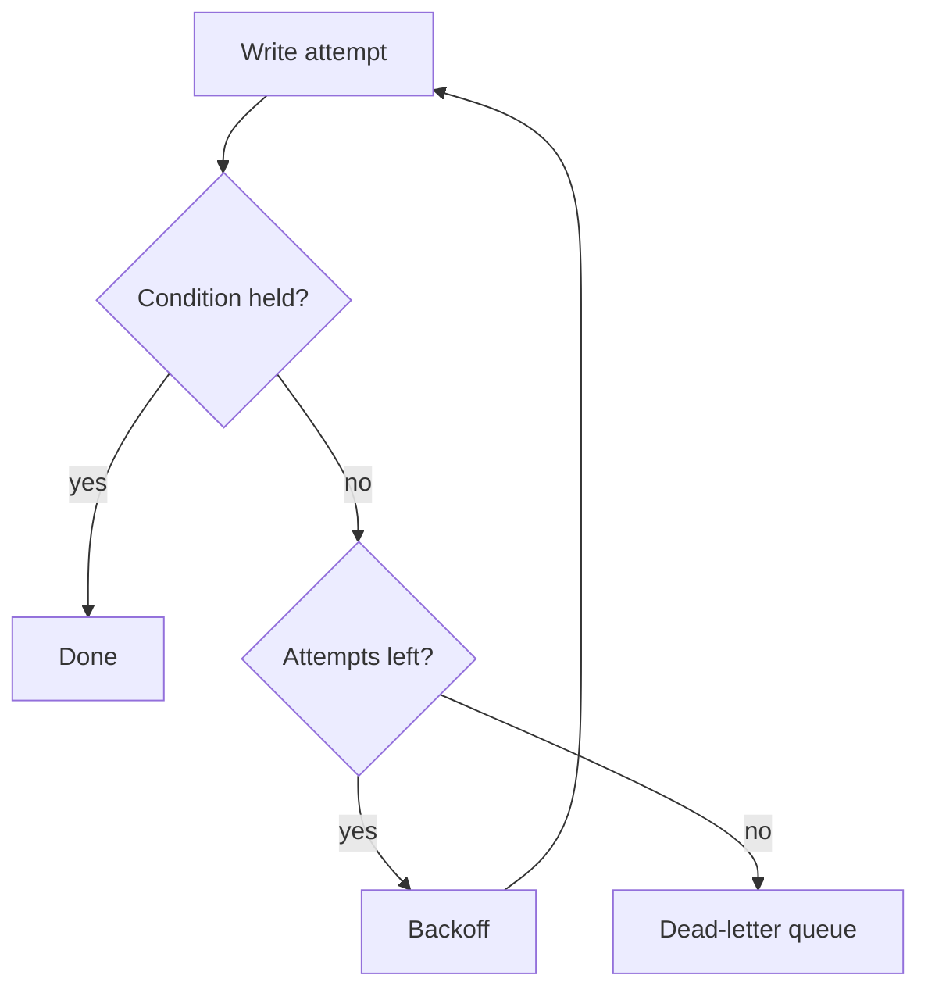

# 5. Retry conflicting writes

Date: 2026-02-27

## Status

Accepted

## Context

The sweeper from [ADR-0003](0003-write-then-publish.md) and the live settlement
worker can touch the same row. Under load, roughly one write in four hundred
lost its conditional check and went to the dead-letter queue, where an operator
re-drove it by hand.

## Decision

Wrap the conditional write in a bounded in-process retry: three attempts with
jittered backoff, then fail to the dead-letter queue. A conflict is expected
contention, not an error, so it is not logged above debug until the bound is hit.

## Consequences

Dead-letter depth became a real signal instead of background noise. The retry
bound is a tuning knob: if exhaustion becomes common it means contention has
genuinely grown, not that the bound is wrong.
